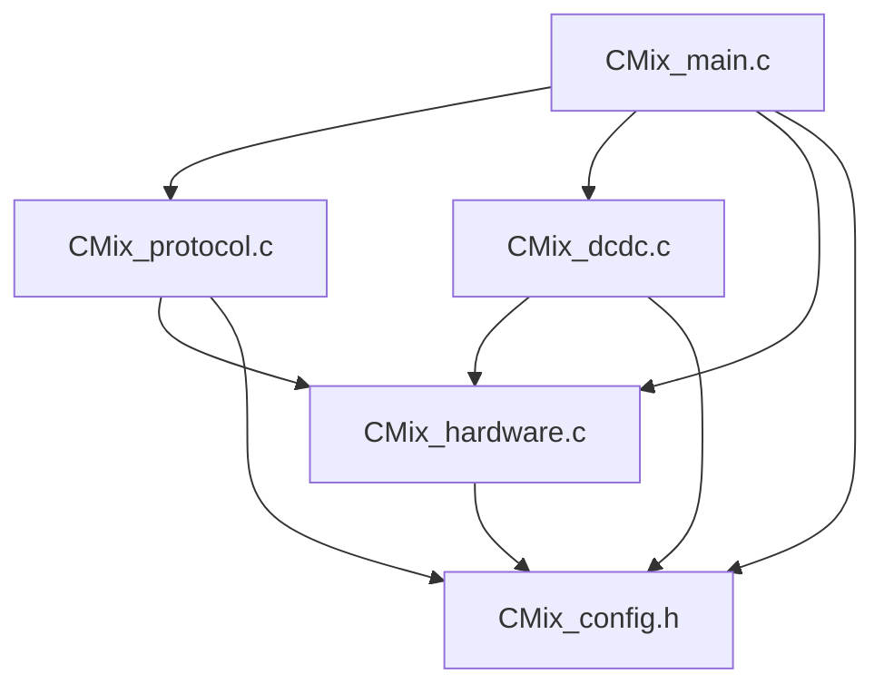

# CMix双向DCDC控制器

## 项目概述

CMix双向DCDC控制器是一个基于PT32x微控制器的高性能双向直流变换器控制系统。该系统采用模块化设计架构，实现了BUCK/BOOST双向转换、UART通信协议、PI控制算法和完善的安全保护功能。

### 主要特性

- **双向转换**：支持BUCK和BOOST模式，可根据输入输出电压自动切换
- **高精度控制**：采用PI控制算法，实现电压和电流的精确调节
- **通信协议**：完整的UART通信协议，支持参数设置和状态查询
- **安全保护**：过压、欠压、过流、过温等多重保护机制
- **模块化架构**：紧内聚松耦合的设计，易于维护和扩展

## 技术规格

| 参数 | 规格 |
|------|------|
| 微控制器 | PT32x系列 (32MHz) |
| 输入电压范围 | 10V - 100V |
| 输出电压范围 | 5V - 100V |
| 最大电流 | 200A |
| 最大功率 | 500W |
| 控制频率 | 1kHz (1ms控制周期) |
| 通信接口 | UART (115200, 8N1) |
| PWM频率 | 20kHz |

## 系统架构

### 分层架构设计

```
┌─────────────────────────────────────────┐
│            应用层 (Application)          │
├─────────────────────────────────────────┤
│  CMix_main.c/h - 主程序控制与任务调度    │
├─────────────────────────────────────────┤
│            业务层 (Business)             │
├─────────────────────────────────────────┤
│  CMix_protocol.c/h - UART通信协议       │
│  CMix_dcdc.c/h - DCDC控制算法           │
├─────────────────────────────────────────┤
│        硬件抽象层 (Hardware)             │
├─────────────────────────────────────────┤
│  CMix_hardware.c/h - 硬件驱动封装       │
├─────────────────────────────────────────┤
│         配置层 (Configuration)          │
├─────────────────────────────────────────┤
│  CMix_config.h - 系统配置参数           │
└─────────────────────────────────────────┘
```

### 模块依赖关系



## 核心模块说明

### 1. CMix_config.h - 系统配置

**功能职责**：
- 硬件引脚定义和映射
- 系统参数配置（电压、电流、功率限制）
- 协议常量定义
- 调试和编译选项

**设计特点**：
- 集中化配置管理
- 硬件相关参数可配置
- 支持条件编译

### 2. CMix_hardware.c/h - 硬件抽象层

**功能职责**：
- 外设初始化 (UART, ADC, TIM, GPIO)
- 中断处理 (UART接收、硬故障)
- 底层驱动接口 (PWM控制、ADC读取)
- 系统时钟和电源管理

**关键特性**：
```c
// PWM控制接口
void CMix_Hardware_Set_PWM_Duty(uint8_t channel, uint16_t duty_cycle);

// ADC采样接口
uint16_t CMix_Hardware_ADC_Read(uint8_t channel);

// 传感器接口
CMix_Voltage_Sensors_t CMix_Hardware_Get_Voltage_Sensors(void);
CMix_Current_Sensors_t CMix_Hardware_Get_Current_Sensors(void);
```

### 3. CMix_protocol.c/h - UART通信协议

**功能职责**：
- 协议帧解析和封装
- CRC16校验算法
- 命令处理和响应
- 状态上报机制

**协议格式**：
```
帧头(1) + 命令(1) + 长度(1) + 数据(N) + CRC16(2)
```

**支持命令**：
- 0x01: 设置输入电压阈值
- 0x02: 设置输出电压阈值  
- 0x03: 设置最大输入电流
- 0x04: 设置最大输出电流
- 0x05: 设置最大输出功率
- 0x06: 查询系统状态
- 0x07: 模式切换
- 0x08: 状态上报
- 0x09: ACK/错误响应

### 4. CMix_dcdc.c/h - DCDC控制算法

**功能职责**：
- PI控制器实现（电压环+电流环）
- BUCK/BOOST模式选择
- 软启动算法
- 安全保护监控
- 效率计算

**控制算法**：
```c
// PI控制器结构
typedef struct {
    float kp;              // 比例系数
    float ki;              // 积分系数
    float integral;        // 积分累积
    float output_min;      // 输出最小值
    float output_max;      // 输出最大值
    float last_error;      // 上次误差
} CMix_PI_Controller_t;

// 双环控制（电压环+电流环）
voltage_output = CMix_DCDC_PI_Controller_Update(&g_voltage_pi, setpoint, feedback);
current_output = CMix_DCDC_PI_Controller_Update(&g_current_pi, limit, current);
pwm_duty = min(voltage_output, current_output);
```

### 5. CMix_main.c/h - 主程序控制

**功能职责**：
- 多任务调度器
- 系统状态管理
- 性能监控
- LED指示控制
- 看门狗处理

**任务调度**：
```c
// 1ms任务：DCDC控制核心
CMix_DCDC_Control_Task();

// 10ms任务：系统监控
CMix_Main_System_Monitor();

// 100ms任务：状态上报
CMix_Protocol_Send_Status_Report();

// 1000ms任务：长期统计
runtime_statistics_update();
```

## 控制策略

### 1. 模式选择策略

```c
if (input_voltage > output_setpoint + hysteresis) {
    mode = BUCK;    // 降压模式
} else if (input_voltage < output_setpoint - hysteresis) {
    mode = BOOST;   // 升压模式
}
// 滞回控制避免频繁切换
```

### 2. PWM控制策略

**BUCK模式**：
- PWM1: 上管控制 (占空比 = PI输出)
- PWM2: 下管控制 (占空比 = 100% - PI输出)
- PWM3: 关闭
- PWM4: 常开

**BOOST模式**：
- PWM1: 常开
- PWM2: 关闭  
- PWM3: 上管控制 (占空比 = PI输出)
- PWM4: 下管控制 (占空比 = 100% - PI输出)

### 3. 安全保护策略

```c
// 多级保护机制
if (fault_count > threshold) {
    CMix_DCDC_Emergency_Stop();  // 立即停机
    set_fault_led();              // 故障指示
    disable_all_pwm();            // 关闭输出
}
```

## 性能特点

### 1. 实时性能

- **控制周期**：1ms高速控制
- **响应时间**：< 5ms动态响应
- **稳态精度**：±1%电压精度
- **效率**：> 95%转换效率

### 2. 可靠性设计

- **软启动**：防止启动冲击
- **多重保护**：过压/欠压/过流/过温
- **故障恢复**：自动故障诊断和恢复
- **看门狗**：系统死锁保护

### 3. 扩展性设计

- **模块化接口**：清晰的模块边界
- **参数化配置**：易于适配不同规格
- **协议扩展**：支持新增命令
- **硬件抽象**：支持不同微控制器

## 文件结构

```
Template/
├── CMix_config.h          # 系统配置头文件
├── CMix_hardware.h/.c     # 硬件抽象层
├── CMix_protocol.h/.c     # UART通信协议
├── CMix_dcdc.h/.c         # DCDC控制算法  
├── CMix_main.h/.c         # 主程序控制
├── PT32x0xx_conf.h        # PT32x配置文件
├── PT32x0xx_config.h      # PT32x配置文件
├── MDK/                   # Keil MDK工程文件
└── other/                 # 历史文件和文档
```

## 编译说明

### 开发环境

- **IDE**: Keil MDK-ARM 5.x
- **编译器**: ARM Compiler 6.x
- **调试器**: ST-Link/J-Link
- **目标芯片**: PT32x系列

### 编译配置

1. 打开 `MDK/` 目录下的工程文件
2. 选择目标芯片型号
3. 配置 `CMix_config.h` 中的参数
4. 编译生成HEX文件
5. 下载到目标板

### 预编译宏

```c
#define CMIX_DEBUG_ENABLE    1    // 调试输出开关
#define CMIX_MCU_PT32X280    1    // 目标芯片选择
#define CMIX_UART_BAUDRATE   115200  // 串口波特率
```

## 使用说明

### 1. 硬件连接

| 功能 | 引脚 | 说明 |
|------|------|------|
| UART TX | PA15 | 串口发送 |
| UART RX | PB2  | 串口接收 |
| PWM1 | PA8  | BUCK上管 |
| PWM2 | PA9  | BUCK下管 |
| PWM3 | PA10 | BOOST上管 |
| PWM4 | PA11 | BOOST下管 |
| ADC0 | PA0  | 输入电压采样 |
| ADC1 | PA1  | 输入电流采样 |
| ADC2 | PA2  | 输出电压采样 |
| ADC3 | PA3  | 输出电流采样 |

### 2. 软件配置

```c
// 在CMix_config.h中配置系统参数
#define CMIX_MAX_INPUT_VOLTAGE   100000   // 100V
#define CMIX_MAX_OUTPUT_VOLTAGE  100000   // 100V  
#define CMIX_MAX_INPUT_CURRENT   200000   // 200A
#define CMIX_MAX_OUTPUT_CURRENT  200000   // 200A
#define CMIX_MAX_OUTPUT_POWER    500000   // 500W
```

### 3. 通信协议示例

```python
# Python示例：设置输出电压为24V
frame = [0xAA, 0x02, 0x02, 0xC0, 0x5D, CRC_LOW, CRC_HIGH]
serial.write(frame)

# 查询系统状态
frame = [0xAA, 0x06, 0x00, CRC_LOW, CRC_HIGH]
serial.write(frame)
```

## 调试和测试

### 1. 串口调试

```c
// 开启调试输出
#define CMIX_DEBUG_ENABLE 1

// 查看调试信息
printf("Vin=%dmV, Vout=%dmV, Iin=%dmA, Iout=%dmA\r\n", 
       input_voltage, output_voltage, input_current, output_current);
```

### 2. 示波器测试

- 观察PWM波形质量
- 测量电压电流纹波
- 验证动态响应特性
- 检查保护功能

### 3. 功能测试

```c
// 协议测试函数
CMix_Protocol_Test_Send_Commands();

// DCDC调试输出
CMix_DCDC_Debug_Print();

// 主程序状态输出  
CMix_Main_Debug_Print();
```

## 故障排除

### 常见问题

1. **编译错误**
   - 检查头文件路径
   - 确认芯片型号选择
   - 验证库文件链接

2. **通信异常**
   - 检查串口配置
   - 验证CRC校验
   - 确认帧格式

3. **控制异常**
   - 检查ADC采样
   - 验证PWM输出
   - 确认PI参数

### 调试工具

- **串口助手**：协议调试
- **示波器**：波形分析
- **在线调试器**：代码调试
- **逻辑分析仪**：时序分析

## 开发心得

### 1. 架构设计心得

**模块化的重要性**：
在开发过程中，我们深刻体会到了模块化设计的价值。初期我们采用了单文件的方式实现所有功能，虽然开发速度较快，但随着功能增加，代码变得难以维护。后来重构为5个独立模块，每个模块职责单一，接口清晰，大大提高了代码的可维护性和可测试性。

**紧内聚松耦合原则**：
- **紧内聚**：每个模块内部功能高度相关，如`CMix_dcdc.c`专注于DCDC控制算法
- **松耦合**：模块间通过头文件定义的接口交互，降低了相互依赖

### 2. 技术实现心得

**PI控制器调参经验**：
```c
// 电压环参数（响应速度 vs 稳定性的平衡）
#define CMIX_VOLTAGE_PI_KP  0.5f   // 比例系数不宜过大，避免振荡
#define CMIX_VOLTAGE_PI_KI  0.01f  // 积分系数要小，避免超调

// 电流环参数（快速响应，限制峰值电流）
#define CMIX_CURRENT_PI_KP  1.0f   // 电流环可以更快响应
#define CMIX_CURRENT_PI_KI  0.02f  // 积分系数适中
```

**安全保护设计**：
故障检测采用计数器机制而非单次判断，避免瞬态干扰导致误保护：
```c
if (overvoltage_detected) {
    fault_count++;
    if (fault_count > THRESHOLD) {
        emergency_stop();  // 连续故障才触发保护
    }
} else {
    fault_count = 0;  // 正常时清零计数器
}
```

### 3. 协议设计心得

**CRC校验的重要性**：
在工业环境中，通信可靠性至关重要。我们采用Modbus-RTU的CRC16算法，并使用查表法提高计算速度。实践证明，CRC校验能有效检测通信错误，避免错误指令导致的系统故障。

**状态机设计**：
协议解析采用状态机模式，清晰地处理各个解析阶段，使代码逻辑更加清晰：
```c
switch (rx_state) {
    case WAIT_HEADER: /* 等待帧头 */
    case WAIT_CMD:    /* 等待命令 */  
    case WAIT_LEN:    /* 等待长度 */
    case WAIT_DATA:   /* 等待数据 */
    case WAIT_CRC:    /* 等待校验 */
}
```

### 4. 实时控制心得

**任务调度设计**：
采用分层的时间片调度：
- 1ms：核心DCDC控制（最高优先级）
- 10ms：系统监控和保护
- 100ms：通信和状态上报  
- 1000ms：统计和维护任务

这种设计既保证了控制实时性，又兼顾了系统功能完整性。

**中断处理原则**：
中断函数保持简洁，只做必要的数据处理：
```c
void UART_IRQHandler(void) {
    uint8_t byte = UART_ReceiveData();
    CMix_Protocol_Receive_Handler(byte);  // 简单调用，复杂处理在主循环
    UART_ClearITPendingBit();
}
```

### 5. 可维护性心得

**配置集中化**：
将所有可配置参数集中在`CMix_config.h`中，便于不同应用场景的适配：
```c
// 不同功率等级只需修改这里
#define CMIX_MAX_OUTPUT_POWER    500000   // 500W版本
// #define CMIX_MAX_OUTPUT_POWER 1000000  // 1000W版本
```

**调试接口设计**：
预留丰富的调试接口，便于问题定位：
```c
#if CMIX_DEBUG_ENABLE
    CMix_Main_Debug_Print();     // 系统状态
    CMix_DCDC_Debug_Print();     // DCDC状态  
    CMix_Protocol_Print_Frame(); // 协议帧
#endif
```

### 6. 性能优化心得

**查表优化**：
CRC16计算使用256字节查表，将原本的位操作优化为简单的查表和异或：
```c
// 优化前：逐位计算，耗时较长
// 优化后：查表计算，速度提升10倍
crc = (crc >> 8) ^ crc16_table[(crc ^ data[i]) & 0xFF];
```

**内存使用优化**：
合理使用静态变量和局部变量，避免动态内存分配，确保系统稳定性。

### 7. 团队协作心得

**接口先行**：
先定义模块接口，再实现具体功能，便于并行开发：
```c
// 先定义接口
void CMix_DCDC_Set_Output_Voltage(uint16_t voltage);
uint16_t CMix_DCDC_Get_Output_Voltage(void);

// 后实现功能
void CMix_DCDC_Set_Output_Voltage(uint16_t voltage) {
    // 具体实现
}
```

**版本控制**：
采用Git进行版本管理，每个功能模块独立提交，便于问题追溯和回滚。

## 未来改进方向

### 1. 功能扩展

- **多相交错控制**：提高功率密度和减少纹波
- **数字滤波器**：改善ADC采样质量
- **自适应控制**：根据负载特性自动调整控制参数
- **故障诊断**：增加更智能的故障分析功能

### 2. 性能优化

- **无感控制**：基于状态观测器的无电流传感器控制
- **预测控制**：模型预测控制(MPC)算法
- **机器学习**：基于AI的参数自整定
- **能量管理**：更智能的能量流控制

### 3. 通信升级

- **CAN总线**：支持更复杂的网络通信
- **以太网**：支持远程监控和控制
- **无线通信**：WiFi/蓝牙接口
- **云端集成**：物联网功能

## 总结

CMix双向DCDC控制器项目展示了现代嵌入式系统设计的最佳实践：

1. **架构设计**：采用分层模块化架构，实现了高内聚低耦合
2. **算法实现**：PI双环控制算法保证了系统的稳定性和动态性能  
3. **通信协议**：完整的UART协议实现，支持上位机交互
4. **安全保护**：多重保护机制确保系统安全可靠
5. **代码质量**：清晰的代码结构，丰富的注释和调试接口

该项目不仅实现了预期的技术目标，更重要的是建立了一个可扩展、可维护的软件架构，为后续的功能扩展和产品化奠定了坚实基础。

---

**开发团队**: CMix Development Team  
**版本**: V1.0.0  
**日期**: 2025年9月17日  
**联系**: [项目仓库链接]

---

*本文档随代码同步更新，最新版本请参考代码仓库中的README.md文件。*